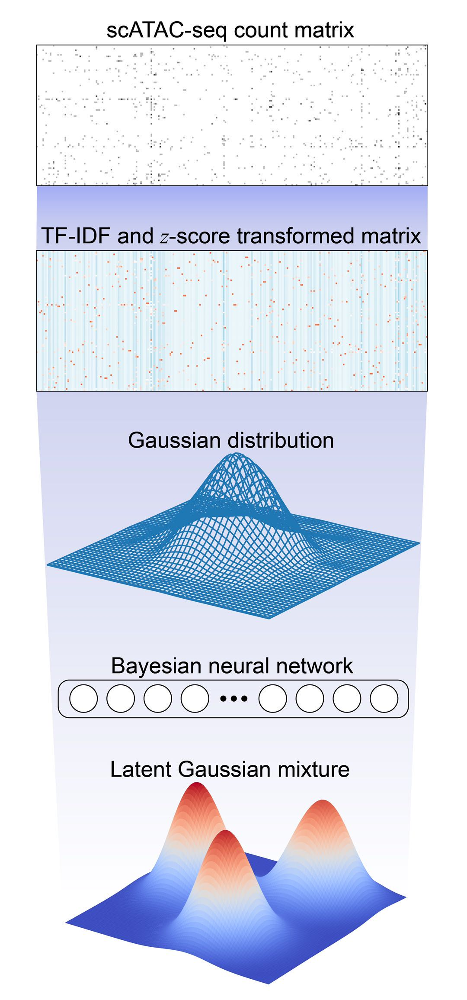

# EpiAnno
##### Single-cell epigenomic data annotation via supervised non-linear embedding
The recent advances in profiling epigenetic landscape of thousands of individual cells increase the demand for automatic annotation of cells, given that the conventional cell annotation method is cumbersome and time-consuming, and several supervised computational methods can hardly characterize the high-dimensional sparse single-cell epigenomic data. Here we proposed EpiAnno, a probabilistic generative model integrated with a Bayesian neural network, to annotate single-cell epigenomic data in a supervised manner.

