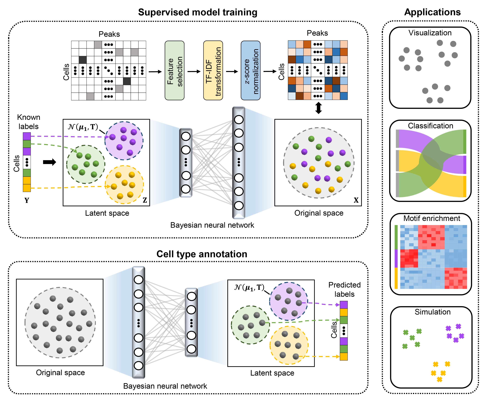

# EpiAnno
#### [Cell type annotation of single-cell chromatin accessibility data via supervised Bayesian embedding](https://www.nature.com/articles/s42256-021-00432-w)
Recent advances in single-cell technologies have enabled the characterization of epigenomic heterogeneity at cellular level. Computational methods for automatic cell type annotation are in pressing need considering the exponential growth in the number of cells. However, the overwhelming majority of efforts has been focused on single-cell gene expression, and it has not been fully investigated for the annotation of single-cell epigenomic data, such as single-cell chromatin accessibility sequencing (scCAS) data. Here, we proposed EpiAnno, a probabilistic generative model integrated with a Bayesian neural network, to annotate scCAS data automatically in a supervised manner.  

<div align=center>

</div>  

## Installation  

```  
Requiements:  
1. Python 3.5 or greater version  
2. CUDA 10.0 
3. Packages for EpiAnno:  
    numpy (==1.19)  
    tensorflow_probability (0.7.0)  
    tensorflow(-gpu) (1.15.2)  
4. Packages for demo:
    hickle (>=3.4)
    scikit-learn (>=0.18)
    hdf5storage (>=0.1.14)
    matplotlib (>=3.3.0)
    seaborn (0.10.0)
    pandas (>=1.1.0)
    umap-learn (>=0.4.1)
Package installation:
$ git clone https://github.com/xy-chen16/EpiAnno   
$ cd EpiAnno   
$ pip install -r requirements.txt
```
## Tutorial  
### demo   
We also provide a [quick-start notebook](https://github.com/xy-chen16/EpiAnno/blob/master/code/demo.ipynb) which describes the fundamentals in detail and reproduces the results of stPlus.
### self-projection   
Two input files(.hkl) are required: 1) a samples-by-peaks Array (samples * peaks) 2) a list(vector) of cell-type labels.  
  
The dataset we used is available on github. First unzip the datasets:  
```  
$ tar -xzvf data/self_projection.tar.gz -C data
```
Then run the self-projection subprogram:
```   
$ cd code/
$ python run_self_projection.py -d data_count.hkl -c cell_type.hkl -o outdir -g gpu
$ cd ..
```
For exsample:
```
$ cd code/
$ python run_self_projection.py -d data/self-projection/InSilico_count.hkl -c data/self-projection/InSilico_cell_type.hkl
$ cd ..
```
Or you can get help in this way:
```  
$ python code/run_self_projection.py -h
usage: run_self_projection.py [-h] [--data DATA] [--cell_type CELL_TYPE]
                              [--outdir OUTDIR] [--verbose VERBOSE]
                              [--gpu GPU] [--seed SEED] [--state STATE]
                              [--latent_dim LATENT_DIM]
                              [--peak_rate PEAK_RATE] [--epoch EPOCH]
                              [--learning_rate LEARNING_RATE]
                              [--n_splits N_SPLITS] [--save_model SAVE_MODEL]
                              [--save_result SAVE_RESULT]

EpiAnno: Single-cell epigenomic data annotation via supervised non-linear
embedding

optional arguments:
  -h, --help            show this help message and exit
  --data DATA, -d DATA  input data path
  --cell_type CELL_TYPE, -c CELL_TYPE
                        input cell-type path
  --outdir OUTDIR, -o OUTDIR
                        Output path
  --verbose VERBOSE     Print loss of training process
  --gpu GPU, -g GPU     Select gpu device number when training
  --seed SEED           Random seed for repeat results
  --state STATE, -s STATE
                        Random state for KFold
  --latent_dim LATENT_DIM, -l LATENT_DIM
                        latent dim
  --peak_rate PEAK_RATE, -r PEAK_RATE
                        Remove low ratio peaks
  --epoch EPOCH, -e EPOCH
                        Epochs for training(50000 for enough training)
  --learning_rate LEARNING_RATE, -lr LEARNING_RATE
                        Learning rate for training(0.15 as a better choice)
  --n_splits N_SPLITS, -n N_SPLITS
                        Number of folds
  --save_model SAVE_MODEL, -m SAVE_MODEL
                        Save parameters of EpiAnno model
  --save_result SAVE_RESULT, -p SAVE_RESULT
                        Save test labels and predicted labels
```

### crossdataset-projection
Three input files(.hkl) are required: 1) a samples-by-peaks Array of train-dataset(samples * peaks) 2) a list(vector) of train-dataset cell-type labels.  3) a samples-by-peaks Array of test-dataset(samples * peaks)
  
The dataset we used is available on github. First unzip the datasets:  
```  
$ tar -xjvf data/crossdataset_projection_Forebrain.tar.bz2 -C data
```
Then run the crossdataset-projection subprogram:
```   
$ cd code/
$ python run_crossdataset_projection.py -d train_data_count.hkl -c train_cell_type.hkl -t test_data_count.hkl -o outdir -g gpu
$ cd ..
```
For exsample:
```
$ cd code/
$ python run_crossdataset_projection.py -d data/crossdataset_projection_Forebrain/Forebrain_count.hkl -c data/crossdataset_projection_Forebrain/Forebrain_cell_type.hkl -t data/crossdataset_projection_Forebrain/MCA_Cerebellum_count.hkl -g 1
$ cd ..
```
Or you can get help in this way:
```  
$ python code/run_crossdataset_projection.py -h
usage: run_crossdataset_projection.py [-h] [--train_data TRAIN_DATA]
                                      [--train_cell_type TRAIN_CELL_TYPE]
                                      [--test_data TEST_DATA]
                                      [--outdir OUTDIR] [--verbose VERBOSE]
                                      [--gpu GPU] [--seed SEED]
                                      [--latent_dim LATENT_DIM]
                                      [--peak_rate PEAK_RATE] [--epoch EPOCH]
                                      [--learning_rate LEARNING_RATE]
                                      [--save_model SAVE_MODEL]
                                      [--save_result SAVE_RESULT]

EpiAnno: Single-cell epigenomic data annotation via supervised non-linear
embedding

optional arguments:
  -h, --help            show this help message and exit
  --train_data TRAIN_DATA, -d TRAIN_DATA
                        input train data path
  --train_cell_type TRAIN_CELL_TYPE, -c TRAIN_CELL_TYPE
                        input train cell-type path
  --test_data TEST_DATA, -t TEST_DATA
                        input test data path
  --outdir OUTDIR, -o OUTDIR
                        Output path
  --verbose VERBOSE     Print loss of training process
  --gpu GPU, -g GPU     Select gpu device number when training
  --seed SEED           Random seed for repeat results
  --latent_dim LATENT_DIM, -l LATENT_DIM
                        latent dim
  --peak_rate PEAK_RATE, -r PEAK_RATE
                        Remove low ratio peaks
  --epoch EPOCH, -e EPOCH
                        Epochs for training(50000 for enough training)
  --learning_rate LEARNING_RATE, -lr LEARNING_RATE
                        Learning rate for training(0.15 as a better choice)
  --save_model SAVE_MODEL, -m SAVE_MODEL
                        Save parameters of EpiAnno model
  --save_result SAVE_RESULT, -p SAVE_RESULT
                        Save test labels and predicted labels
```
## Citation
If you find our work is useful for your research, please kindly cite our paper: 
Chen, X., Chen, S., Song, S. et al. Cell type annotation of single-cell chromatin accessibility data via supervised Bayesian embedding. Nat Mach Intell 4, 116–126 (2022). <https://doi.org/10.1038/s42256-021-00432-w>
## Contact 
If you have any questions, you can contact me from the email: <xychen20@mails.tsinghua.edu.cn>
